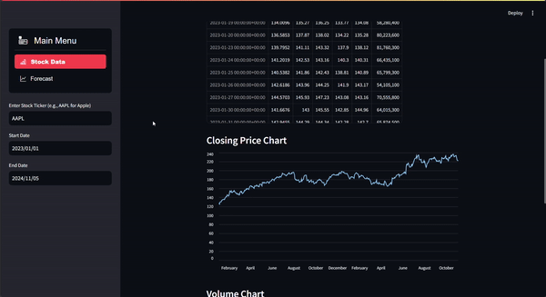

# Clairvoyant v2.0

Clairvoyant v2.0 is a Streamlit-based web application for viewing and forecasting stock prices. It allows users to visualize historical stock data and make future predictions using Facebook's Prophet model, enabling more informed investment and trading decisions.

## Features
- **Historical Stock Data Viewer**: Displays historical stock prices, including interactive charts for closing prices and trading volumes.
- **Forecasting**: Predicts future stock values for up to 1 year, leveraging the Prophet model to account for trends, seasonality, and other factors.
- **Interactive Interface**: User-friendly sidebar for easy stock ticker selection, date range inputs, and forecast period adjustments.
- **Customization Options**: Offers flexibility for users to choose forecast periods, making it suitable for both short- and long-term stock analysis.

## 🛠️ Tech Stack
Core Framework
Python 3.11+ · Streamlit, LSTM Model

## Data & AI
yfinance · pandas · Prophet


## Demo
Below is a demonstration of the Clairvoyant v2.0 application in action:


<!-- Replace 'demo.gif' with a path to the actual GIF or video file -->

> **Tip**: To create a GIF, you can use screen recording software like **OBS Studio** or **Loom** and convert the video to a GIF using tools like **ezgif.com**.

## Installation and Setup


### Step 1:Create Virtual Envirnment :- 
-------------------

1. Install Python 3.11 wither from official site or miscrosoft store

2. Create a Virtualenvironment using venv

python3.11 -m venv venv

3. Activate the Environment

Windows

cmd.exe - 

C:\> <venv>\Scripts\activate.bat

PowerShell - 

PS C:\> <venv>\Scripts\Activate.ps1

.\venv\Scripts\activate

Useful commands :=

deactivate

### Step 2: Clone the Repository
Clone the repository to your local machine:

```bash
git clone https://github.com/regostar/streamlit_stocks.git
cd streamlit_stocks
```

### Step 3:Install requirements :- 

pip install -r requirements.txt

### Step 4:Run app:- 

streamlit run app.py

## App Screenshots :- 


